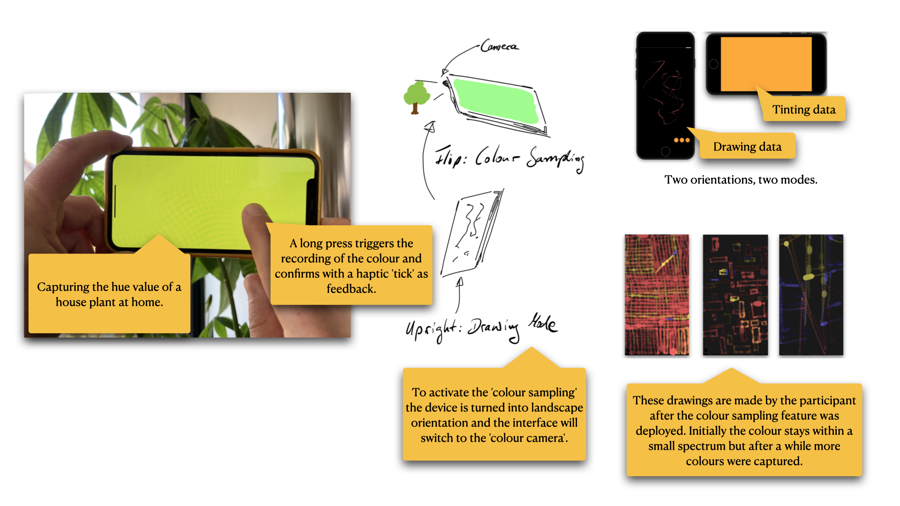

# Abstract

The following documentation provides account of the development process of interactive prototypes to explore how creative technologist practice can enable nourishing relationships between internet connected technologies and the experience of our bodies. There are three approaches of prototypes: [Making a Step Tracker using open technologies](#making-a-step-tracker), [Exploring 'Data as Ink'](#exploring-data-as-ink), and [Making 'The Drawing Thing'](#making-a-drawing-thing). The repository captures notes during the making phase, reflections on code and hardware related as integral to design decisions, and documents making aspects of the co-design process when the final prototype was deployed with a participant. All code relevant for the prototype is openly available [as part of this documentation here](code/).

# Acknowledgements

This project has been supervised by Jayne Wallace (UNN), Mel Woods (UoD), Mehan Jayasuriya (Mozilla Foundation), and Max von Grafenstein (UdK).

This project is part of [Open Design of Trusted Things (OpenDoTT) doctoral training network](https://opendott.org.) and has received funding from the European Union’s Horizon 2020 research and innovation programme under the Marie Skłodowska-Curie grant agreement No. 813508.

# Introduction

The overarching research question that informs the research presented in this documentation asks:

- How can creative technologist practice enable nourishing relationship between internet connected technologies and our bodies and sense of self?

The main objective of WP2 is to develop capacity to shape emerging best practices around the use of open technology and practices in relation to wearable technologies. To address this objective, I used research through design and a thinking through making approach. I focus on step tracking data as an iconic and well understood data characteristic by investigating through making physical digital prototypes which use code and electronic hardware as materials of inquiry. Furthermore, the thinking through approach making also examines my own agency as a researcher towards the material—of sensors, microprocessor prototyping boards, other digital components related to internet connected technology for the body.

The development of prototypes took place in three major steps:

1) [Making a step tracker using open technologies](#making-a-step-tracker)
2) [Exploring 'Data as Ink' using creative coding](#exploring-data-as-ink)
3) [Making 'The Drawing Thing'](#making-a-drawing-thing)

To understand the concept of step tracker I set out to think it through by making one. In parallel, I explored the idea of using 'data as ink' by making a simply drawing application and using pre-recorded data. In connection with the co-designed IoT concept 'Haptic Memories' from WP1, insights from both lines of inquiry led to the final prototype: 'The Drawing Thing'. This prototype was then deployed with a participant (remotely) and extended collaboratively with them in co-design activity over the course of 3 months with regular meetings every two to three weeks.

To address this, I pursued a radical minimization approach to guide design decisions in the process, forming a lean technology approach in prototyping for the body. This also connects to other contexts i.e., to data minimization in relation to GDPR or the notion of lean data as used by Mozilla.
Further, accuracy of sensors and/or algorithms turned out to be a crucial aspect to have a reliable common ground. This influenced the choice of hardware for the final prototype: using a smartphone. While it opposes the initial objective of using open technology, it addressed the issue of accuracy, provided a know and potentially trusted platform for working with participants, and made me review the lived experience of open technology.

## Why focus on step data

<!-- Tracking of steps or better, step count data, is chosen because -->
To focus on relationships to data I chose step tracking (step count data) because 1) it is an iconic and commonly known data characteristic of the body; 2) doing steps and counting them is tangibly relatable. The choice is further informed by [the insight I gained from the open technology training](#learning-from-open-technology-training) that reducing functionality in a prototype is beneficial to background technological trivia and distractions.

The hypothesis is that by bringing a well understood type of data (step count) of the body back to the body, we can gain insights on other forms of relating and creating agency to devices and data of the body. However, the simplicity of step data turned out not to be easy to implement algorithmically, as I experienced by making a step tracker.

## Learning from Open Technology training

The key learning from the Open Technology training is that an inquiry into the relationship to data benefits from focusing on minimization of features. During the training I came to the conclusion that a feature packed prototype using novel connectivity leads to a technology centred design probes which foreground technological feasibility. Increased risk of technical issues would further distract the design process and the work with participants. The aim of the research is to enable a nourishing ground to meaningfully investigate relationships to data of the body, not to demonstrate emerging technologies and their capabilities. Increasingly distributed data of the body require an investigation of our relationships, agency, and understandability.

# Making a Step Tracker

Based on the insight to minimize and focus on single function in terms of technology, I began to make a step tracker to get to know this kind of wearable with and through material exploration with the following research question:

- Can I make a wearable step tracker using open technologies which is accurate and trustworthy enough to be deployable with participants?

The key aspect I applied to the making was to put myself in the position of someone wanting to make a step tracker at home. It should allow me to assess the understandability of resources openly available in contrast to sophisticated industrial products. As a side effect, this also addresses the challenges of making physical digital prototypes at home with constraint facilities during a pandemic situation.

The making enabled to think through required components, explore their materiality in hardware and software, and assess how feasible it is in the context of the research to make without becoming an engineering task. Very early in the process of making it became clear that the amount of components it too high. For example, finding a board with a similar set of sensors but with an onboard charging unit would simplify the making. For all the sketches I continued to use open technology as much as possible. First I used what I had available to begin making as quickly as possible.

## Using an online tutorial

For the first sketch I followed [the most recently published online tutorial on making a step tracker using an Arduino and an accelerometer](https://circuitdigest.com/microcontroller-projects/diy-arduino-pedometer-counting-steps-using-arduino-and-accelerometer). While the tutorial explained the process well, the way the steps were detected turned out to require a very particular and conscious way of walking, running, moving otherwise. Similar to what was shown in the demonstration video of the tutorial.

From this I understood that the detection of steps is more intricate than common sense would assume. There is a technology related gap revealing itself between an act of movement that is so embodied to ourselves, and the challenge of 'seeing it' through algorithmic processing of a series of measurements. I was not satisfied with how this algorithm 'saw' me walking.

From here I researched new possibilities to improve the accuracy in two directions 1) [Sensors with built-in step detection](#sensors-with-built-in-step-detection), providing the computation/detection of steps; this is known as 'in silicon' meaning implementing the computation as part of the integrated circuit which is etched in silicon and thus out of reach to look at for a user or myself as creative technologist. 2) [finding third party code](#finding-third-party-code), preferably open source and preferably within the Arduino community; given the code is open source, the question of understandability here depends on how legible the code is for the users or for myself as creative technologist.

## Sensors with built-in step detection

The first direction revealed that certain accelerometers provide built-in step detection, indeed. However, the one featured on the main processing board I was using did not. I exchanged the Arduino BLE Sense for an Adafruit Feather Sense which featured such a sensor and came with easy to use code library.

This combination of hardware with matching code libraries felt like making progress. I was able to extend the initial testing code with data logging to an SD card. I chose an SD card for ease of use and because is it widely known as an object that stores digital data.

When I took the prototype out for measurements, I also took my smartphone which has built-in step tracking as a reference. After analysing the recordings it became clear, that the sensor with built-in step detection is not accurate. A gap of roughly 90 steps within 23 minutes.

<!-- Not sure about the following section -->
## Finding third party code

The next attempt I took was to integrate the code library ['Open Source C-Step-Counter' by Anna Brondin & Marcus Nordstrom at Malmö University](https://github.com/MarcusNordstrom/C-Step-Counter). The library did not provide readily useable code sketch for the type of boards I was using. After I had integrated it for the Arduino environment I was able to assess the functionality.
The resulting count was very difficult to determine. It was not accurate and rarely worked. I was unable to produce a fully working integration. Other third party library code was either not available or replicated the simple inaccurate implementation used in the initial online tutorial.
Unfortunately, such an outcome is not rare in the context of open source libraries. However, an in-depth discussion of responsibilities of maintainers and authors of code libraries and the reliability of software is out of scope for this documentation.

## Insights from Making a Step Tracker

After also failing with the open source pedometer algorithm, I felt to have reached a pivot point of open technology and practices in relation to wearables and the body.

The key insight is that using open technology in relation to data of the body has revealed several key challenges: power supply over a longer period of time; directly related to that are code practices, algorithmic choices, and assessment of third party code for impact on energy use; size of components; and lastly their wearability.

The issues of power supply, data storage, and connectivity to other IoT devices are not trivial. Additionally, intricate technical fixes felt like undermining trustworthiness of the prototype, especially when deployed to a participant.
In summary, I experienced making a step tracker at home with limited facilities as challenging even with prior technical experience in creative technologies. The most useable result had its core functionality embedded in a closed piece of technology (a chip providing step count). However, it was still not accurate compared to a consumer reference product. Measurements from test runs show a signifiant gap in accuracy when compared to sophisticated step tracking using a smartphone. For the context of the research project on trust and IoT, I consider accuracy a crucial aspect of a prototype. Lacking accuracy could undermine building a relationship with the design probe for the participant.

The other materializing insight from this step of prototype development are mundane things emerging as meaningful key objects during the making process.

Pegs, rubber bands, and an SD card begin to seep in—first unintentionally, later on purpose by soldering wires to an SD card adapter. They begin to complement prototype sketches during the making process as ordinary objects of both the known environment and the unknown object. They contribute a handle or access point which provides familiarity. Not only that, but they do not require in-depth knowledge to put to use in a diverse range of situations, unlike an anonymous printed circuit board (PCB) equipped with oblique tiny components. However, coherent with the minimization approach, they must have a purpose and be functional within the prototype. For example, the stock SD card adapter with soldered jumper wires replaces an open hardware component without loss of functionality.

# Exploring Data as Ink

In parallel to making a step tracker, I addressed a research question in connection to the co-design concept 'Haptic Memories' from WP1:

- How can data become a resource for creative expression and reflection?

By transforming step count data into (virtual) ink for drawing, the data became a resource for creative expression to reflect on the data of one's body through an embodied act of drawing.

To prototype this aspect with a visual focus first, I used the creative coding toolkit [p5js](https://p5js.org), a successor to [Processing](http://processing.org), because I prefer using JavaScript for quick iterations and to get a feel for a programming project.

To get a data set of actual step counts, I exported data which my smartphone captured for some time already using an application available on the app store. I picked a time window of 1 day and converted it into JSON format to load into the p5js editor.

The sketch is open available online: [editor.p5js.org/jns/sketches/v6paYO0wX](https://editor.p5js.org/jns/sketches/v6paYO0wX). Clicking the play button on the top left enables the drawing canvas on the right.

## Insights from exploring Data as Ink

In summary, the code sketches showed that interaction of data as ink can be a joyful and novel experience which can be followed up using a touch based drawing hardware and real data in a deployable prototype.

The exploration produced three key insights:

1) The act of drawing with data brings the data of the body back and close to the body; as if putting the pen to draw diagrams of the data back into the hands of the person from whom the data came from.
2) The interaction creates an unfamiliar but intriguing and meaningful space to reflect on body related data of ourselves.
3) Activated through movement, data as 'ink' becomes a visual and tactile collaborative resource, encouraging embodied reflection with and through data *in time*.

The purpose of the drawings is to serve as a visual memory aide, a reverberation of a resonance with data of the body. They do not provide an exact representation of the data for analysis.

Key to the prototyping process was to bring together the imagined and the lived experience by putting a conceptual idea of 'data as ink' into an interactive sketch. Connecting an actual (although pre-recorded) data set, preliminary data processing, and programming showed that even through simple doodling unexpected joy of anticipating behaviour of the 'ink' was significantly different to conventional forms such as bar graphs, charts, and others. This opened new ways to reflect and literally re-trace data in an embodied way.

The emerging follow-up research question to asks: Does the joyful experience of data as ink also resonate with others than the creative technologist who made it?

# Making a Drawing Thing

(The code for this prototype is openly available [as part of this documentation here](code/the-drawing-thing)).

Making 'The Drawing Thing' is the final step of prototypes addressing the question:

- Can we bring the drawing experience closer to the body?

By using a smartphone as familiar (mundane) hardware platform we address the challenges of accuracy and energy management identified earlier. It is an established hardware platform, is ready at hand in the current situation of working from home, and it is a device familiar to participants. Furthermore, the touchscreen and a built-in tactile feedback unit addresses tangible requirements to address closeness additional to the conceptual aspect of 'data as ink'.

For a deployable prototype, the p5js sketches of the previous step had to be ported into a standalone application, native to the operating system (iOS).

## Technical challenges and approaches

Most smartphone feature built-in step tracking. To minimize privacy issues I used old Apple iPhone. For initial sketches my personal phone. For the deployment a separate re-used device fully self-contained, factory reset and stripped of any applications, features, and settings as possible, with a separate account for each device.
HealthKit is Apple's code library/programming framework providing to access the specialized encrypted and access controlled data storage for health related data on the device. For example, the prototype benefits from the built-in feature that users must to actively consent to individual data characteristics before any application code can access the data. The operating system presents users/participants a screen familiar to them. The choices made can be changed at any point in a separate application.
Furthermore, the smartphone as a hardware platform provides sophisticated power management, enabling recording of steps efficiently even when phone is not active, and it features a touch screen for the drawing canvas. These aspects made it a good candidate to use and focus on the experience of drawing with data in a reliable environment.
To port the sketches in JavaScript into an application for iOS with access to the HeathKit data store, I gradually learned the Swift programming language to establish a fluent making process.

## Initial Version

The design goal of the initial version was to use and show as little technology and capability as possible. Because the device was black, the canvas became black. This further consolidated a consistent solid appearance of the device when the canvas is empty; the infamous black brick. Posing a intensional 'un-open' impression to contrast the open exploration through drawing with one's own data.

The structure of the programming interface of the underlying data storage (Apple HealthKit) to retrieve data, two time related parameters must be provided: 1) a start and end date for which to request data, and 2) the interval in which the measurements will be summarized. After trying different intervals, steps per minute revealed the best balance between granularity and amount of resulting ink.

The core data to ink drawing algorithm can be simplified as:

1) On startup and reset, fill the 'inkwell' by querying the data store for step count with an interval of 1 minute since X about days (defined by the user in the settings).
2) When drawing, pick the next steps per minute measurement from the list and use it to adjust stroke thickness and transparency.
3) Stop the drawing functionality when the inkwell is empty.

Based on the former sketches the first data to ink algorithm only produced black and white strokes based on the fact if the current measurement was greater than zero or not; a direct digital interpretation. In a second step the variance of the data (the fluctuating steps per minute) became the basis to influence stroke opacity/transparency.

## A minimal graphical user interface

The very first iterations of the prototype had no graphical user interface. However, to enable sharing of drawings in conventional ways, a manual clearing of the canvas, and access to the settings for stroke behaviour and how many days of data to consider, I added a minimal UI.

- A progress bar to show the state of the inkwell
- A set of three buttons for sharing/exporting the drawing, clearing the canvas, and accessing the settings.

The UI is hidden by default to give the drawing space and activity undistracted attention. By triple tapping on the screen the UI appears and can be hidden with the same gesture. The triple tap made it easy to integrate in code and also served as a humorous anecdote of vigorous tapping when a device seems to not work. This functionality must be explained to the participant(s).

## Deployment and co-designed changes

In the initial minimal version, prototype was deployed with a participant and extended collaboratively with them in co-design activity with regular meetings every two to three weeks. The participant is creative practitioner in the fields of music and illustration. Over the course of 3 months the participant has lived with the device they produced 1380 drawings in total.

The following section documents the iterative changes made based on the conversations during the co-design activity. In summary four adaptation have been made to the prototype:

- [Adding colour](#adding-colour) to the stroke based on time of the current data point.
- A [settings screen](#adding-control) to give the participant more control on the spectrum in which the stroke width varies and the number of days from which to transform steps to ink.
- [A continuous canvas](#a-continuous-canvas) to create drawings which can stretch over multiple drawing sessions; fading strokes enable potentially infinite drawings.
- Adding the ability of [intentional tinting of data](#adding-intentional-data-capturing---tinting-data-with-colour) by capturing colour hue from the environment like taking a photograph.

### Adding colour

After about 3 weeks with the initial version, the first request of the participant was to have colour in the ink.
I responded to this by transforming the timestamp of the current steps/minute data point to a hue value. By normalizing the time of day on a 24 hours basis to values between 0.0 to 1.0 a colour could be computed where the hue represents the minute of day the steps took place.
This worked well for some time but was described by the participant as repetitive after a while. However, having colour was appreciated and followed up with a later change of [manual intentional colour recording](#adding-intentional-data-capturing---tinting-data-with-colour).

### Adding control

To give the participant control how the stroke width can vary and to adjust the amount of ink, I introduced a settings screen providing access to those parameters. Over time the participant actively incorporated these controls in their drawing practice. Based on my experience the implementation of such user interface controls can outweigh the code of the core functionality of the application extensively. Fortunately, linking the parameters of the settings to their respective locations in the drawing code did not add too much of additional code because of a direct support by the programming framework.

### A continuous canvas

To open new ways to expand the drawing with data as ink the idea emerged to change the canvas for longer periods of drawing. By continuously fading strokes over time the canvas became an infinite space clearing itself. Interestingly it also added depth to the drawings as line would appear further away the 'older' the became. This effect was not anticipated.
The manual reset of the canvas was not removed to still be able to clear the canvas. However, the conversation with the participant touched on introducing other constraints such as having to wait for hours or days until the canvas would clear by itself. Or, to play with enforcing a timely distance between the reflections and give 'The Drawing Thing' a character of its own.

### Adding intentional data capturing — Tinting Data

Based on the [initial introduction of colour](#adding-colour) the last change that was made in collaboration with the participant was to move the determination of the colour value away from a deduction based on the data. By introducing an intentional way to influence—or 'tint'— the data we were interested if the manual recording of data would provide an additional quality to the relationship to the step data; and if this would emerge meaningfully in the drawings.
The 'colour camera mode' activates by tilting the device into landscape, move it around to search for a hue value worth recording, and through a long press on the screen 'lock' this colour resulting in a tinting of any data that is recorded until the next colour is recorded.

The implementation of a manual recording of colour became challenging because a programming interface narrowly designed for purpose of taking a picture obstructs simple access to image stream of built-in camera. To allow for a real-time hue extraction nevertheless I had to extensively research and add complex code which allowed me to analyse the incoming pixel stream of the camera. After removing this technical obstacle, I was able to explore making a 'colour camera' (see figure above).

Over several design stages, it became clear that key to the design process were to playfully follow the minimization approach and follow the most radical design decision. The resulting 'single pixel camera' resonates not only with the minimization approach but also addresses ‘data minimization’ (Art. 5 and partially 6 GDPR) and privacy as ‘data protection through design’ (Art. 25 GDPR) by asking what is essential for the data recording.

# Conclusions

The key insight from the prototype development is that technology aesthetics and concerns stay in the foreground when using open technology. Because of the requirement to respond to a broad spectrum of needs, open technology falls short providing distinct functionality which can be meaningfully combined (in physical appearance and written code) for wearability while avoiding a strong technological narrative. For example, the lack of integrated small form factor power supply with charging capabilities, code libraries written with awareness of energy consumption, or prototypes easily becoming technology demonstrators. 
To develop capacity to shape emerging best practices around the use of open technology and practices in relation to our bodies and sense of self becomes challenging if the inquiry is less in line with a gadget narrative.
The unfolding gap between challenges of using open technologies and the convenient accuracy of sophisticated consumer products connects back to issues of trustworthiness and agency. For example, with open technologies it becomes difficult to assess how to trust different appearing measurements in relation to their accuracy beyond a demonstration of functionality, resulting in an emerging distrust. However, closed consumer products bear the difficulty to open the technologies themselves, resulting in a request of trust.

The documentation demonstrates these challenges of making functional interactive prototypes using both, open technologies and sophisticated consumer products. I navigated the technological difficulties and underlying conceptual challenges by understanding them as a material inquiry. Instead of adding features and technological capabilities, the minimization approach asks what can be removed. For example, by focusing on step count as data of the body, and by gradually removing user interface or reducing a highly developed built-in camera to a single pixel colour sensor. This created an in-depth inquiry into unpicking what the relationship to this data reveals when experienced as drawing.

Lastly, the minimization approach also suggests attention to the role of mundane objects—analogue and digital alike. Rubber bands, pegs, soldered SD cards, and also smartphones may provide handles with which we can pry open potential obstacles of increasingly opaque technologies that intersect with our bodies and sense of self.
